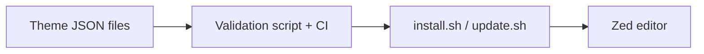

Sites/zed-themes/README.md#L1-260
# cyberpunk-zed-themes

A git-backed collection of Zed editor themes with an automated installer, updater, and optional quarterly auto-update for macOS (launchd). I created tooling so you — or any Zed user — can install, update, and maintain the theme set safely and reproducibly.

## ANZSCO 261312 Skills Snapshot
- Automation of developer-experience tooling with script-driven installation/update.
- Release and validation workflow design for reliable theme distribution.
- Operational documentation that supports reproducible setup at scale.

This repository includes:
- `themes/` — your curated themes (imported from your current `~/.config/zed/themes`)
- `previews/` — optional screenshots for each theme
- `install.sh` — safe, idempotent installer (symlink by default)
- `update.sh` — git pull + install helper
- `uninstall.sh` — restore backup/remove symlink
- `scripts/validate_theme.py` — minimal JSON validator for CI
- `.github/workflows/validate-and-release.yml` — validate on PRs and package releases
- `com.zed.themes.autoupdate.plist` — optional launchd plist for periodic updates

Quick index
- Installation (per-user, symlink): see "Quick install"
- System-wide install: supported but intentionally conservative (requires sudo)
- Auto-update: optional quarterly schedule (launchd)
- CI: minimal validation (checks theme JSON + "name" key)

Quick install (per-user — recommended)
1. Clone the repo:
```Sites/zed-themes/README.md#L1-8
git clone https://github.com/<org-or-user>/zed-themes.git ~/zed-themes
cd ~/zed-themes
```

2. Run the installer (symlinks by default):
```Sites/zed-themes/install.sh#L1-30
./install.sh
```
The installer will:
- Back up any existing `~/.config/zed/themes` (timestamped)
- Create a symlink `~/.config/zed/themes -> ~/zed-themes/themes`
- Keep the repo as the canonical source so edits in the repo are reflected immediately in Zed

Common options to `install.sh`
- `--copy` — copy files to `~/.config/zed/themes` instead of symlinking
- `--system` — install to `/usr/local/share/zed/themes` (requires sudo; installer will copy)
- `--bootstrap` — create helper files (already created in this scaffold), CI workflow, and an example `plist`
- `--update` — `git pull` and reinstall (same as `update.sh`)
- `--uninstall` — restore backup or remove symlink
- `--dry-run` — show actions without performing them
- `--yes` — assume yes for prompts (useful for automation)

Example: copy-install (per-user)
```Sites/zed-themes/install.sh#L40-80
./install.sh --copy
```

System-wide install (admin)
If you want to provide themes system-wide (for multiple users), you can install to `/usr/local/share/zed/themes` using:
```Sites/zed-themes/install.sh#L100-140
sudo ./install.sh --system
```
Notes:
- The installer will copy files into `/usr/local/share/zed/themes`.
- To expose system themes to a particular user: `rm -rf ~/.config/zed/themes && ln -s /usr/local/share/zed/themes ~/.config/zed/themes`

Updater
`update.sh` pulls the latest changes from the repo and runs the installer. Typical usage:
```Sites/zed-themes/update.sh#L1-32
./update.sh
```
Options:
- `--remote` and `--branch` — control which git remote/branch to pull
- `--dry-run` — preview actions
- `--no-install` — update repo but do not run the installer

Auto-update (macOS launchd — quarterly)
I recommend a user-level `launchd` agent to check for updates periodically (you requested quarterly). The repo includes a sample plist `com.zed.themes.autoupdate.plist` you can install with:
```Sites/zed-themes/com.zed.themes.autoupdate.plist#L1-60
cp com.zed.themes.autoupdate.plist ~/Library/LaunchAgents/com.zed.themes.autoupdate.plist
launchctl load -w ~/Library/LaunchAgents/com.zed.themes.autoupdate.plist
```
The plist is configured with a `StartInterval` of ~90 days by default. Edit the plist before loading if you want a different interval.

Uninstall / rollback
- If you want to remove the installed themes and restore a previous backup:
```Sites/zed-themes/uninstall.sh#L1-16
./uninstall.sh
```
- The installer creates backups as `~/.config/zed/themes.backup.<timestamp>`. `uninstall.sh` will restore the most recent backup when present.

CI and validation
- The repo includes a minimal validator `scripts/validate_theme.py` which:
  - scans `themes/**/*.json`
  - ensures each file is valid JSON and contains at least a top-level `name` key
- GitHub Actions workflow `validate-and-release.yml` runs validation on PRs affecting `themes/` and packages a release zip for tags `v*`.

Contributing
- Add a new theme by creating a JSON file under `themes/` (or a directory if you prefer to include a preview image).
- Include a preview in `previews/` and add/update `index.json` if you want machine-readable metadata (optional).
- Run `./scripts/validate_theme.py` locally before opening a PR:
```Sites/zed-themes/scripts/validate_theme.py#L1-100
./scripts/validate_theme.py themes
```
- Follow the repo's code style and keep commits focused. Provide a preview image and a short description in your PR.

Security & permissions
- `install.sh` will prompt before destructive operations unless you pass `--yes`.
- System-wide installs require `sudo`. I recommend per-user symlink installs for most users (safer and easier to maintain).

Suggested workflow for maintainers (you)
1. Keep `themes/` in a local repo you control.
2. Make changes and validate locally.
3. Push to remote and create a GitHub release (tag) for major updates.
4. Users get changes by running `./update.sh` or via the launchd agent if enabled.

Files of interest
- `install.sh` — primary installer and bootstrapper (`Sites/zed-themes/install.sh`)
- `update.sh` — updater (`Sites/zed-themes/update.sh`)
- `uninstall.sh` — uninstaller (`Sites/zed-themes/uninstall.sh`)
- `scripts/validate_theme.py` — validator used by CI (`Sites/zed-themes/scripts/validate_theme.py`)
- `com.zed.themes.autoupdate.plist` — sample launchd plist (`Sites/zed-themes/com.zed.themes.autoupdate.plist`)

License
This repository is released under the MIT License. See `LICENSE` for the full text.

Support / next steps I can take for you
- Create the GitHub remote and push the initial commit (you previously asked for this; I can do it if you provide a remote or grant access).
- Fine-tune the `StartInterval` in the plist or change scheduling to `cron` if preferred.
- Convert the validator into a stricter JSON-schema check if you want stricter validation.
- Package the themes for a Zed marketplace/extension if Zed supports it.

If you want, I can now:
- initialize the local git repo, commit these files, and push to a remote you provide, and
- optionally enable the launchd plist for quarterly auto-updates.

Tell me which of those you want me to do next.


## Problem
Developers need a reproducible way to install, update, and validate custom editor themes at scale.

## Solution
A curated Zed theme collection with installer/update scripts, validation automation, and optional scheduled updates.

## Architecture Diagram


## Tech Stack
- Shell scripting
- Python validation tooling
- GitHub Actions
- JSON theme assets

## Setup Instructions
```bash
git clone https://github.com/jen-the-dev/cyberpunk-zed-themes.git
cd cyberpunk-zed-themes
./install.sh
```

## Testing
- python3 scripts/validate_theme.py themes
- Run CI validation workflow on PRs

## ANZSCO 261312 Competency Evidence
- Tooling automation and release workflows.
- Configuration/package lifecycle management.
- Developer-experience engineering through reproducible setup.

## Commit Convention
Use Conventional Commits for presentation clarity:
- `feat(scope): add new user-facing capability`
- `fix(scope): resolve functional defect`
- `test(scope): add or improve automated tests`
- `docs(readme): improve project documentation`

## Evidence Map
- `themes/`
- `scripts/validate_theme.py`
- `install.sh`
- `.github/workflows/`
