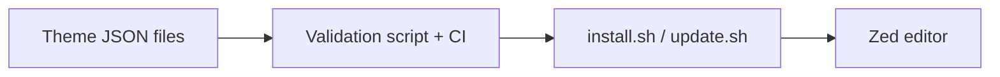

# cyberpunk-zed-themes

A git-backed collection of Zed editor themes with an automated installer, updater, and optional quarterly auto-update for macOS (launchd). I created tooling so you — or any Zed user — can install, update, and maintain the theme set safely and reproducibly.

## Problem
Developers need a reproducible way to install, update, and validate custom editor themes at scale.

## Solution
A curated Zed theme collection with installer/update scripts, validation automation, and optional scheduled updates.

## Architecture Diagram


## Tech Stack
- Shell scripting
- Python validation tooling
- GitHub Actions
- JSON theme assets

## Setup Instructions
```bash
git clone https://github.com/jen-the-dev/cyberpunk-zed-themes.git
cd cyberpunk-zed-themes
./install.sh
```

## Testing
- python3 scripts/validate_theme.py themes
- Run CI validation workflow on PRs

## Commit Convention
Use Conventional Commits for presentation clarity:
- `feat(scope): add new user-facing capability`
- `fix(scope): resolve functional defect`
- `test(scope): add or improve automated tests`
- `docs(readme): improve project documentation`

## Evidence Map
- `themes/`
- `scripts/validate_theme.py`
- `install.sh`
- `.github/workflows/`
